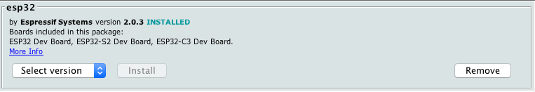
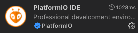
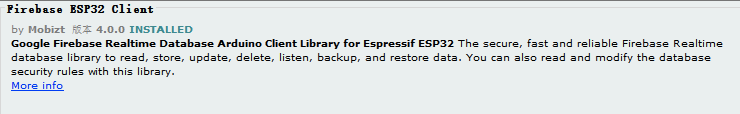

# 基于ESP32的物联网ioT开发


## 驱动安装

### CH340串口


### CH9102f 串口

个人经验, `CH9102`芯片与`macOS`兼容度很差. 大概率会有上传代码失败的可能. 建议使用`Windows`系统


## 开发环境配置

ESP32开发环境种类繁多, 例如

- Arduino IDE 内嵌 ESP32 idf库
- Vscode - PlatformIO 内嵌 ESP32 idf库
- Vscode - PlatformIO 内嵌 Arduino ESP32 库
- Vscode - ESP-IDF插件进行裸机开发
- Vscode - ESP-IDF插件外加Arduino作为component进行开发

乐鑫自带ESP32的编译器, 因此也无法使用通用的ARM-GCC. 个人猜测原因是因为部分**固件不开源**.


### Arduino环境

- **Step 1:** 官网下载 [Arduino](https://www.arduino.cc)

- **Step 2:** 配置开发版

  打开 `Arduino` -> `Preference` ;

  找到`Additional Boards Manager URL` ;

  添加以下链接:

  ```
  https://raw.githubusercontent.com/espressif/arduino-esp32/gh-pages/package_esp32_index.json
  ```

  

- **Step 3:** 添加开发板

  打开`Boards Manager`, 搜索`ESP32`

  

  点击安装

  


### PlatformIO环境

- **Step 0: ** Windows系统必须额外安装[Python](https://www.python.org) , 务必选择`Add Python 3.xx to PATH` , 因为默认不勾.

- **Step 1:**  安装 [Vscode](https://code.visualstudio.com)

- **Step 2: ** 打开`Extension` 选项卡, 侧边栏图标 

- **Step 3: ** 搜索`PlatformIO IDE`

  

- **Step 4: ** 重启Vscode
- **Step 5:** 左侧边栏打开`PlatformIO IDE`, 


### Vscode + ESP-IDF + Arduino (推荐)

友情提醒:


不要下错版本, 否则白做


- **Step 1:**  安装 [Vscode](https://code.visualstudio.com)

- **Step 2: ** 安装[ESP32-IDF](https://docs.espressif.com/projects/esp-idf/en/latest/esp32/get-started/index.html#installation-step-by-step) 如果想在Vscode进行插件安装,直接跳转至**Step 6**

- **Step 3: ** 安装[git](https://git-scm.com/download/win)

- **Step 4: ** 输入一下命令

  ```bash
  $ cd x/xxx/xxxx         # Your working directory
  $ mkdir -p components 
  $ cd components 
  $ git clone https://github.com/espressif/arduino-esp32.git arduino 
  $ cd arduino 
  $ git submodule update --init --recursive 
  $ cd ../.. 
  $ idf.py menuconfig
  ```

  

  这个选项取决于你想用`app_main()`的方式还是Arduino的`setup()`和`loop()`方式.

  

- **Step 5: ** Vscode配置

  打开Vscode, 从ESP32官方的example中随便复制一份出来, 并将其拖入Vscode.

  打开`File`->`Save as Workspace`, 保存工作环境, 命名随意.

  打开`xxxx.code-workspace`文件. 这实质是一个JSON文件, 用于每次Vscode启动配置.

- **Step 6: ** 在Vscode下载`ESP-IDF`插件

  打开`View`->`Command Palette`, 搜索`ESP-IDF: Configure ESP-IDF extension`. 选择你的`framwork`如果没有也可以安装.

- **Step 7: ** 新建project

  打开`View`->`Command Palette`, 搜索`ESP-IDF: Show ESP-IDF project examples `,随便选个项目.

- **Step 8: ** 构建project

  点击底部


## 安装Firebase库

### Arduino

- **Step 1: ** 打开`Sketch`->`Include Library` ->`Manage Libraries`

- **Step 2: ** 搜索`Firebase ESP32 Client`

  


## 写在最后

ESP乐鑫的项目配置非常繁琐. 不建议新手入坑. 
